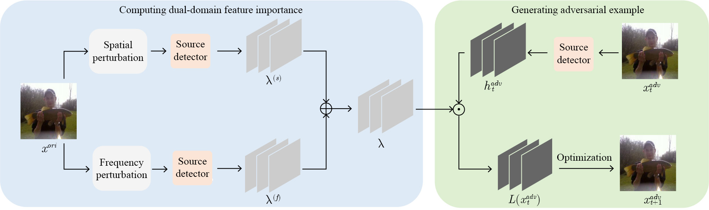

## Transferable Dual-Domain Feature Importance Attack Against AI-Generated Image Detector
An official implementation code for paper "[Transferable Dual-Domain Feature Importance Attack Against AI-Generated Image Detector](https://ieeexplore.ieee.org/document/11365532)". 

## Framework
<p align='center'>  
  
</p>
<p align='center'>  
  <em>Detailed illustration of proposed DuFIA. A original image, after undergoing spatial and frequency domain perturbations, is fed into a source detector, and the dual feature importance at an intermediate layer is obtained via backpropagation. The feature importance is then multiplied element-wise with the same intermediate layer feature map of the adversarial example, producing a loss that guides the generation of the adversarial sample in the next iteration.</em>
</p>

## Dependency
- Python 3.8.8
- PyTorch 1.12.0
- Torchvision 0.13.0

## Data

- This repository uses the same test datasets as the paper [Towards Universal Fake Image Detectors that Generalize Across Generative Models](https://utkarshojha.github.io/universal-fake-detection/).
- This should create a directory structure as follows:
```

datasets
└── test					
      ├── progan	
      │── cyclegan   	
      │── biggan
      │      .
      │      .
	  
```
- Each directory (e.g., progan) will contain real/fake images under `0_real` and `1_fake` folders respectively.


## Usage

Run the DuFIA attack on your dataset with:
```bash
python attack.py --dataset_root ./datasets/test --save_root ./outputs --model_name CLIP:ViT-L/14 --epsilon 8 --step_size 0.8 --steps 10
```

## Citation
If you use this code for your research, please cite our paper
```
@article{zhu2026transferable,
  title={Transferable Dual-Domain Feature Importance Attack Against AI-Generated Image Detector},
  author={Zhu, Weiheng and Cao, Gang and Liu, Jing and Yu, Lifang and Weng, Shaowei},
  journal={IEEE Signal Processing Letters},
  year={2026},
  publisher={IEEE}
}
```
## License
Licensed under a [Creative Commons Attribution-NonCommercial 4.0 International](https://creativecommons.org/licenses/by-nc/4.0/) for Non-commercial use only.
Any commercial use should get formal permission first.

## Acknowledgement
This code is based on [UFD](https://utkarshojha.github.io/universal-fake-detection/) and [RFIA](https://github.com/ljwooo/RFIA-main). Thanks for their awesome works.